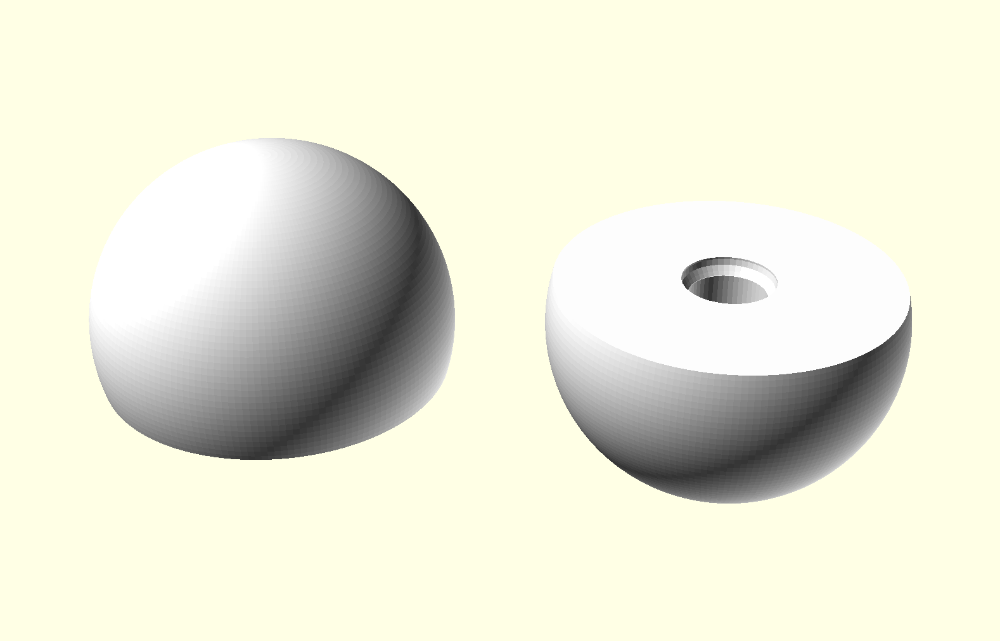
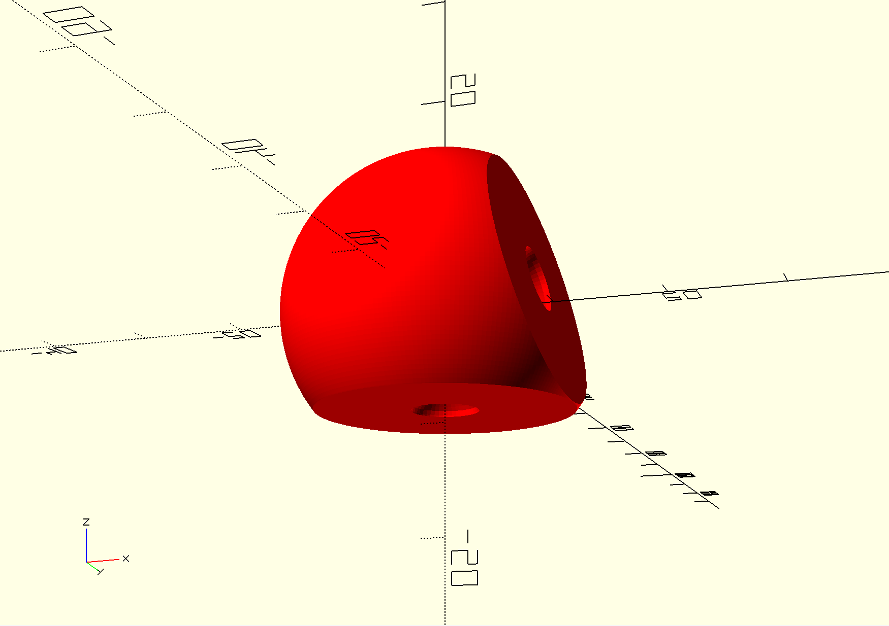

# Modules and Functions

There are several modules and functions that have been created to make it easier to piece together multiple components.
We describe here how the user can interact with these modules. While this list is not exhaustive, we aim to document the
main features available.

* [Working With the Atomic Scale](#working-with-the-atomic-scale)
* [Elements and Element Properties](#elements-and-element-properties)
* [Space Filling Atom](#space-filling-atom)

## Working With the Atomic Scale

The natural unit to use when working on the atomic scale is the picometer, but we also have to create the atoms and
molecules at a scale that allows us to 3D print them. Part of the constraint on size is being able to print the
snap rings that join multiple atoms together. Therefore we define a scale so that we can specify dimensions in
picometers. We call the scaling constant `pm`. So if we want something to be 100 picometers we can specify it as
`100*pm`. This scaling factor (and other constants) is defined in `scad/utils/constants.scad`.

## Elements and Element Properties

Since we are dealing with atoms we want to make it as easy as possible to interact with atomic properties. We define
some function that can be used in `scad/atoms/element_properties.scad`. For example,

```
cpk_color(H)
```

will return the CPK color for Hydrogen. You can pass any of the atomic elements that are defined in
`scad/atoms/elements.scad` to this function.

Similarly,

```
van_der_waals_radius(H)
```

will return the Van der Waals radius of Hydrogen.

## Space Filling Atom

The `space_filling_atom` module can be found in `scad/atoms/atom.scad` and is the main vehicle for creating the
individual atoms within molecules. Depending on what molecule is being produced, you can adjust the bond distances and
angles. For each bond that is specified, this will create the bonding interface surface along with the negative space to
receive a `snap_ring`. For example, to make a hydrogen atom that will bond with another hydrogen atom you would do
this:

```
space_filling_atom(atom_radius = 120*pm, color_name = "white", bond = [120*pm, 64*pm]);
```


When the atom being made only has a single bond the `bond` argument is sufficient to specify this, but when multiple
bonds are in question, then you must specify multiple bonds along with their spacial relationship to each other. We can
specify multiple bonds with the `bonds` argument. For example, this will produce the following:

```
space_filling_atom(
  atom_radius = van_der_waals_radius(O),
  color_name = cpk_color(O),
  bonds = [
    [van_der_waals_radius(H), 95.84*pm, [-90, 0]],
    [van_der_waals_radius(H), 95.84*pm, [14.45, 0]]
  ]
);
```

