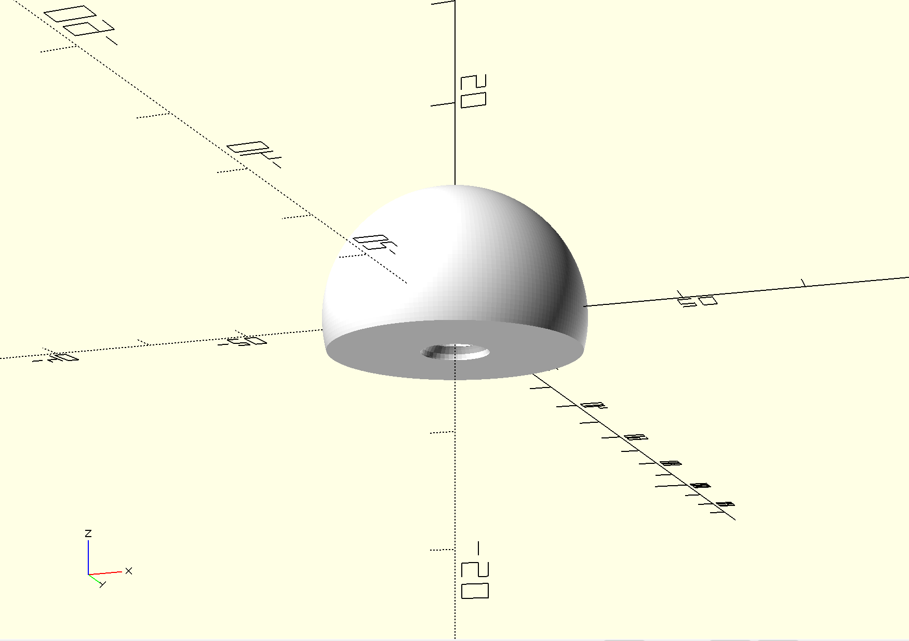

# Modules

There are several modules that have been created to make it easier to piece together multiple components. We describe
here how the user can interact with these modules.

## Elements and Element Properties

TODO

## Space Filling Atom

The `space_filling_atom` module can be found in `./scad/atoms/atom.scad` and is the main vehicle for creating the
individual atoms within molecules. Depending on what molecule is being produced, you can adjust the bond distance and
angles. For each bond that is specified, this will create the bonding interface surface along with the negative space to
receive a `connection_pin`. For example, to make a hydrogen atom that will bond with another hydrogen atom you would do
this:

```
space_filling_atom(atom_radius = 120*pm, color_name = "white", bond = [120*pm, 64*pm]);
```

